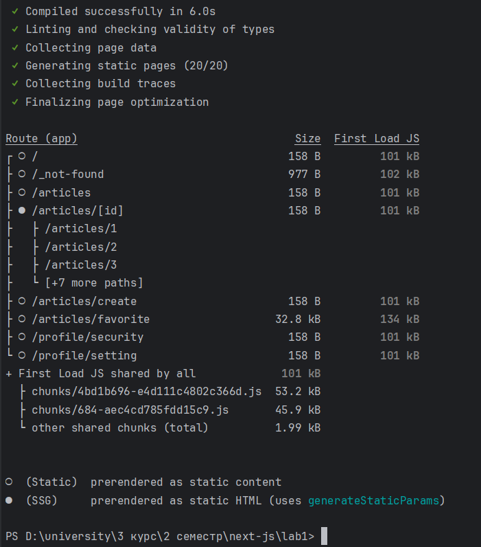

**скріншоти на ходу виконання лабораторної роботи**

**завдання 2_6 Додати підсвічування**

**завдання 3_1 Вивести інформацію з отриманих даних**

**завдання 3_2 Сторінка завантаження**

**завдання 3_4 Окремі індикатори завантаження для FavoriteArticle**

**завдання 3_7 збілдити апку**

**завдання 3_8 запустити за допомогою npm http-server**

**завдання 4_2 модульна scss файл для стилізації меню**

**завдання 4_5 компонент MUI у FavoriteArticle**
